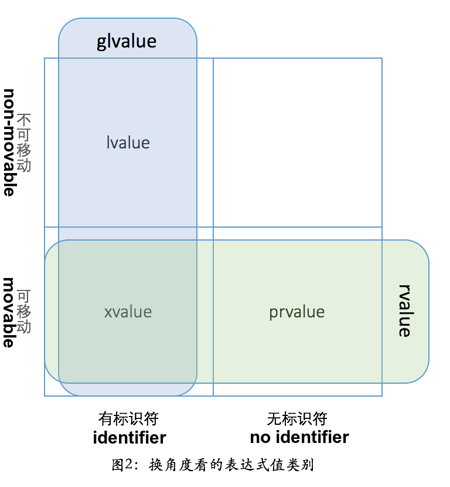

## Types of Values

- **lvalue:** `++x`, `x = 1`, `cout << '...'`, `"hello world"`
- **xvalue (expiring value):** `std::move(ptr1)` can be considered as a named rvalue, distinguished from unnamed pure rvalue (prvalue)
- **prvalue:** smart_ptr ptr1{`new circle()`}, `return circle()`

## Value Categories

C++ has unique concepts of value categories - lvalue/rvalue:

### Value and Reference Types Comparison

| Language | Value Types                                          | Reference Types                  |
| -------- | ---------------------------------------------------- | -------------------------------- |
| C++      | All primitive types, enums, structs, unions, classes | References (&) and pointers (\*) |
| Java     | Primitive types (numbers, etc.)                      | Classes                          |
| Python   | None                                                 | All                              |

C++ primarily uses value semantics - parameters are passed by value (copied) by default.
