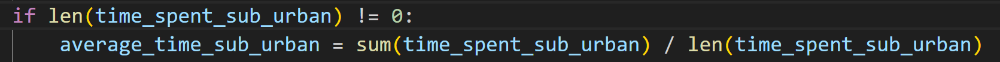

While using Black Formatter in VSCode, we can set the maximum line length to prevent some code to be wrapped lines by reformat operation.

Add these in setting.json.

```json
{
    "black-formatter.args": [
        "--line-length",
        "90"
    ]
}
```

Before:


After:



About the best line length number, refer to [Black document](https://black.readthedocs.io/en/stable/the_black_code_style/current_style.html#line-length).

> In general, 90-ish seems like the wise choice.
