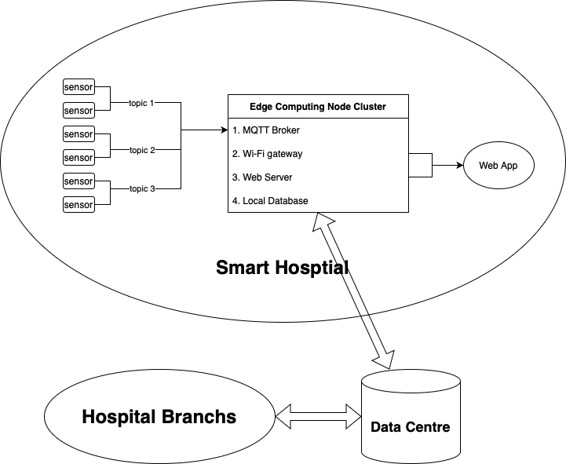
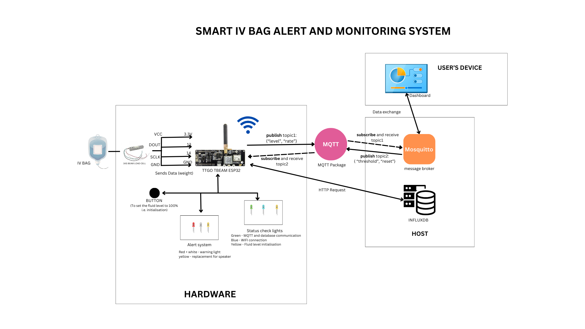
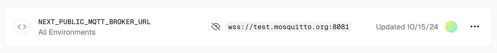

This project is a uni project in which we designed and implemented a full-stack medical information monitoring system combining hardware and software at 2024 S2. The final product utilizes various sensors to monitor data from medical instruments and consolidates the information into a dashboard web application for convenient viewing. The source code is open-sourced and available on [GitHub](https://github.com/Dzx1025/CITS5506-IoT) and the live demo is also available on <https://vitaltrack.dzx1025.com>.

My primary responsibilities in this project included developing the dashboard application and designing the APIs. As such, this article will primarily focus on the software development aspects of the project:

## System Architecture

Due to budget constraints for the school project, we only used infusion bag sensors for the hardware component. Also considering the requirements for high hardware scalability and low power consumption, the specific hardware configuration is as follows:

|Hardwares|Number|
|-|-|
|TTGO T-Beam v1.2 ESP32 - 915MHZ Version|1|
|Jumper Wires|10|
|Mini External USB Stereo Speaker|1|
|1kg Beam Load Cell|1|
|Buttons|1|
|LED of different colours|5|

The hardware structure after assembly and the functions of each component are shown in the diagram below:


In this project, we primarily used the MQTT protocol for communication, with all communication data stored in InfluxDB. Ideally, these services would be deployed on hospital servers. Following a client/server (C/S) architecture, the topic-based features of MQTT enable a convenient management model for different departments and floors.



## Platform Setup

For the MQTT protocol, I chose the open-source implementation Mosquitto. When Mosquitto is installed and running on the host machine, the host acts as the MQTT broker, providing relay services for all monitoring nodes, i.e., ESP32 devices. In our demo, both Mosquitto and InfluxDB are installed on a personal PC.

We use topics to tag hospital staff, monitoring data, and patient identities while utilizing an **Access-Control List (ACL)** file to ensure proper authorization. For example, `public/ivbag/patientId` represents public data about an IV bag associated with a patient identified by `patientId`. For a specific IV bag sensor, the payload might be:

```json
{
  "level": 43,
  "rate": 23.52,
  "timeLeft": {
    "hour": 0,
    "minute": 30
  }
}
```

For more detailed Mosquitto configuration, refer to [GitHub MQTT Configuration](https://github.com/Dzx1025/CITS5506-IoT?tab=readme-ov-file#mqtt-configuration).



## Software usage


### Connecting

Because the dashboard application is hosted on the Vercel platform, if you want to set up your own version, you may need to provide your own environment variable `MQTT_BROKER_URL`.



In the application, simply input the patient’s monitoring ID and reconnect. If logging in as hospital staff, you need to enter the corresponding administrator username and password in the **Advanced Settings**. Note these staff credentials need to be preconfigured in Mosquitto. When logged in as an staff, the topic used will be private, and there will be permission to modify the configuration of the ESP32 hardware, not just limited to the web app side.


These values will be cached in local storage to avoid repeated inputs.

### Monitoring

For regular patient users, they can monitor commonly used data via the dashboard and adjust the local Alert Threshold by dragging the slider.


When the remaining IV bag capacity falls below the alert threshold, both the app and the ESP32 emit a warning sound to alert the user. Clicking the Stop button will stop the app’s warning sound.


At the same time, the ESP32 board will send the data to the InfluxDB for logging.


## Scalability

Additionally, since the application is developed using **Next.js**, it can be conveniently converted into a React Native app for use on mobile platforms such as Apple devices. Here is a short demonstration video: <https://youtube.com/shorts/qPmOdOjlymg?si=D9SlY9jT2-UZ5Gxz>.
